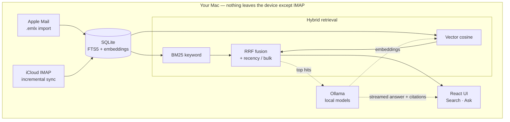

# MailFind

**Private semantic search and Q&A over your Apple Mail — runs entirely on your Mac.**

MailFind indexes your mail locally and lets you *search by meaning* ("that contract about delivery dates") and *ask questions* ("do I have any new online assessments?") with cited answers. Your mail, the embeddings, and the language model all stay on-device. The only packets that leave your machine are the IMAP fetches to iCloud.

Built with Tauri 2 (Rust) + React. Embeddings and answers run on a local [Ollama](https://ollama.com) instance.

---

## Features

- **Semantic + keyword search, fused.** Hybrid retrieval combines BM25 full-text search (SQLite FTS5) with in-Rust vector cosine over local embeddings, merged via Reciprocal Rank Fusion, with recency and bulk-mail adjustments.
- **Ask your mail (RAG).** A local LLM summarizes the retrieved emails and answers your question, streamed token-by-token with clickable citations back to the source messages.
- **Fully on-device & private.** No servers, nothing to deploy, no telemetry. Credentials live in the macOS Keychain.
- **Apple Mail import + iCloud sync.** Imports messages Apple Mail already stored locally (instant), then keeps up to date over IMAP with a UID watermark.
- **Scales to your hardware.** A RAM-aware model picker matches the Ask model to your Mac — from search-only on 8 GB up to a 35B-class model on 48 GB+ — instead of a hard memory floor.

---

## How it works



**Search:** the keyword and vector passes each retrieve candidates, fusion ranks them (with a recency multiplier so fresh mail wins ties, and a penalty for bulk/newsletter senders), and the UI shows the ranked messages.

**Ask:** the top-ranked emails become context for a local chat model, which writes a cited answer. Retrieval is identical to Search, so answers are grounded in the same results you'd see there.

---

## Requirements

- **macOS** (uses the system Keychain for credential storage)
- **Rust ≥ 1.77** and **Node 20+**
- **[Ollama](https://ollama.com)** running locally
- The embedding model (required for indexing, ~0.3 GB):

  ```bash
  ollama pull nomic-embed-text
  ```

- An **iCloud app-specific password** — generate one at <https://appleid.apple.com>.

### Choosing an Ask model — automatic

Semantic search needs only ~1.5 GB and runs on any Mac. The chat model for the **Ask** tab is what needs memory, so on first run MailFind detects your RAM and auto-selects the best model that both fits and is already installed. If none is installed, the app shows the exact `ollama pull` command; if your Mac is below the threshold, Ask stays off and search still works.

| Your Mac's RAM | Auto-picked Ask model | Pull command |
| --- | --- | --- |
| 8 GB | Search only (Ask off) | `granite4.1:3b` as a warned opt-in |
| 16 GB | `qwen3:8b` | `ollama pull qwen3:8b` |
| 32 GB | `gpt-oss:20b` | `ollama pull gpt-oss:20b` |
| 48 GB+ | `qwen3.6:35b-mlx` | `ollama pull qwen3.6:35b-mlx` |

You can override the choice anytime in **Accounts → Ask model**; your pick is remembered and never auto-overridden.

---

## Run

```bash
./dev.sh
```

See [packages/desktop/README.md](packages/desktop/README.md) for syncing iCloud, trying the app with bundled `.eml` fixtures (no iCloud needed), and producing a release build.

---

## Repository layout

- [packages/desktop/](packages/desktop/) — the Tauri desktop app.
  - [src/](packages/desktop/src/) — React UI; calls Rust via Tauri `invoke`.
  - [src-tauri/](packages/desktop/src-tauri/) — Rust core: IMAP client, SQLite + FTS5 store, Ollama client, hybrid search, RAG Q&A, RAM-aware model selection.
- [docs/](docs/) — vision, architecture, and decision records.

There is no backend service. There is nothing to deploy. The app runs entirely on your machine.
