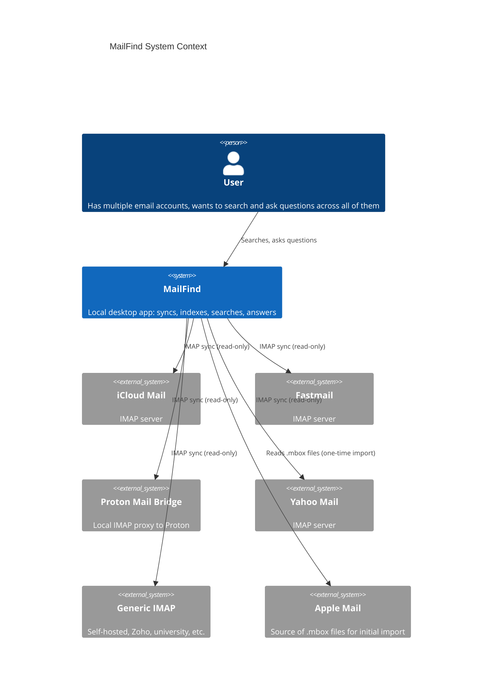
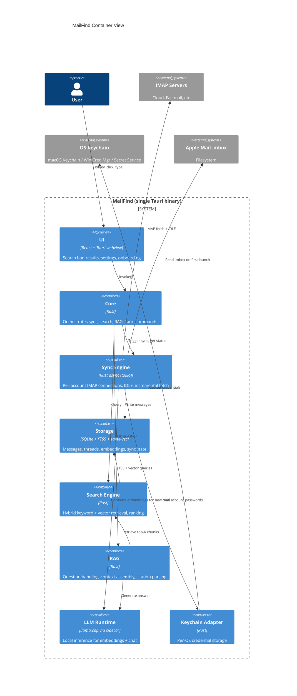
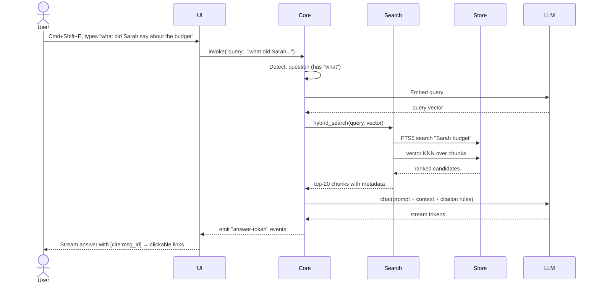
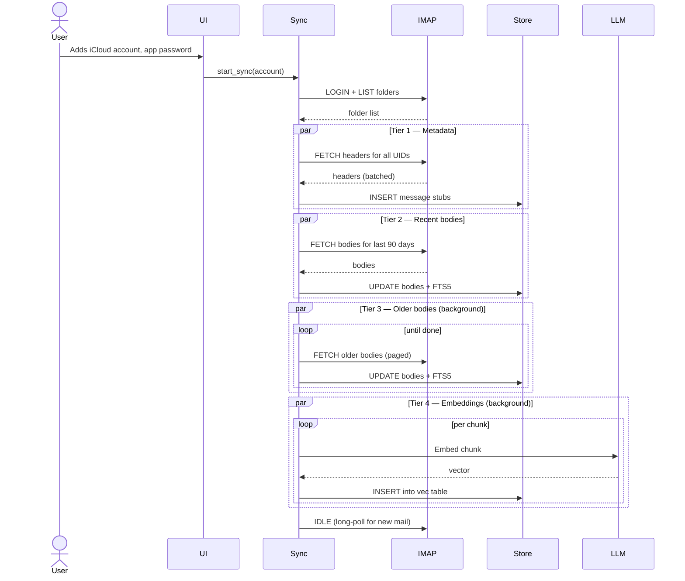
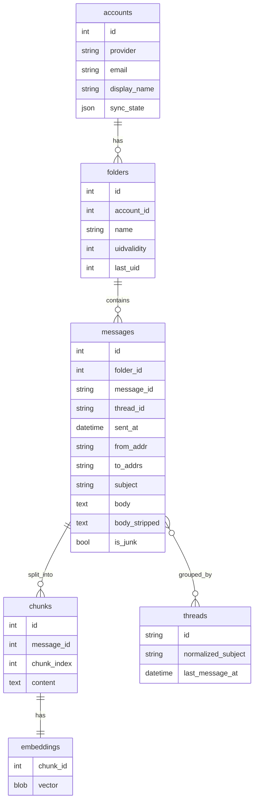

# MailFind — Architecture

This document describes the system at two levels: the world MailFind lives in (System Context) and the major running pieces (Container view). Code-level structure is left to the codebase itself.

## Level 1 — System Context

MailFind is a single-user desktop application. Everything happens on the user's machine. The only outbound network traffic is to email servers (IMAP) for fetching mail.

**Key properties:**

- No backend service. No MailFind servers exist.
- No outbound traffic except IMAP fetches and (opt-in) crash reports.
- All credentials in OS keychain.
- All data in local SQLite + local model files.

## Level 2 — Container view

The app is one Tauri binary, but internally has clearly separated processes/threads.

## Component responsibilities

### UI (React + Tauri webview)

- Renders the global hotkey overlay (search bar + results + answer view)
- Renders settings, onboarding, account management
- Renders menu bar icon and tray
- Calls Rust via Tauri `invoke()` — never touches data or network directly
- Streams answer tokens from RAG via Tauri events

### Core (Rust)

- Tauri command handlers that bridge UI → backend
- Owns app lifecycle: startup, shutdown, hotkey registration
- Coordinates the sync engine, search engine, RAG
- Holds the application config (accounts, preferences, license)

### Sync Engine (Rust async)

- One IMAP connection per account, kept alive with IDLE for live updates
- Tiered sync strategy:
  1. **Tier 1 (minutes):** metadata only (subject/from/to/date) for entire archive
  2. **Tier 2 (hour):** full body + FTS5 index for last 90 days
  3. **Tier 3 (background, days):** full body for everything older
  4. **Tier 4 (background, days):** embeddings, last 90 days first
- Resumable across restarts (UID + UIDVALIDITY tracked per folder)
- Throttle awareness per provider
- Detects junk/marketing mail via `List-Unsubscribe` header + sender frequency, deprioritizes embedding

### Storage (SQLite + extensions)

- Single SQLite database file in app data directory
- Tables: `accounts`, `folders`, `messages`, `threads`, `chunks`, `embeddings`, `sync_state`, `license`
- FTS5 virtual table for keyword search over message body + subject
- `sqlite-vec` extension for vector storage and KNN search over chunk embeddings
- WAL mode for concurrent read during sync writes

### Search Engine (Rust)

- Hybrid retrieval: FTS5 (BM25) + vector cosine, fused with reciprocal rank fusion
- Pre-filters by account, sender, date range when query implies them
- Recency boost (newer = higher rank, configurable decay)
- Returns ranked message chunks with stable IDs for citation

### RAG (Rust)

- Decides: keyword query vs question (presence of `?`, `what/when/who/why/how`, length heuristic)
- For questions: retrieve top-K chunks → assemble prompt with citations format → stream LLM tokens → parse `[cite:msg_id]` tags into clickable links
- For aggregation queries ("summarize all from X"): different code path — filter all matches, summarize in batches, combine
- Always returns sources alongside answer

### LLM Runtime

- Bundled `llama.cpp` binary as Tauri sidecar
- Loads `nomic-embed-text` for embeddings
- Loads chat model (default: `granite4.1:3b` or equivalent ~2-3B parameter quantized model)
- HTTP-style API on local socket (no network exposure)
- Hardware detection picks Metal (Apple Silicon), CUDA (NVIDIA), or CPU
- Models downloaded on first launch (not bundled in installer to keep download small)

### Keychain Adapter

- macOS: Security framework via `security-framework` crate
- Windows (v2): Credential Manager via `windows-credentials` crate
- Linux (v2): Secret Service via `secret-service` crate
- Stores per-account IMAP passwords / OAuth tokens

## Data flow: a search query

## Data flow: initial sync

## Storage schema (sketch)

(Note: `embeddings` is actually a `sqlite-vec` virtual table in practice; ER notation is approximate.)

## Why these choices

| Choice | Reason |
|---|---|
| **Tauri** | 10-20MB binaries vs Electron's 100MB+. Native webview. Cross-platform with one codebase. Already in use. |
| **Rust core** | Performance for sync + indexing. Memory safety for code that handles user mail. Strong async ecosystem (tokio). |
| **SQLite + FTS5 + sqlite-vec** | Single-file storage, ACID, no daemon. FTS5 is mature. sqlite-vec gives us vector search without a separate vector DB. |
| **Bundled llama.cpp sidecar** | Removes Ollama as a user dependency. Apple Silicon Metal acceleration is solid. Cross-platform builds available. |
| **Local-only architecture** | Core differentiator. No backend = no infra costs = no recurring revenue requirement = one-time pricing works. |
| **IMAP over JMAP** | Universal. Every target provider supports it. JMAP would be cleaner for Fastmail but limits provider support. |
| **No daemon, app must be running** | Simpler than a background launchd/systemd service. Menu bar icon makes "running" feel ambient. Trade-off: no sync when app fully quit. |

## Architectural decisions deferred

- Whether to expose a CLI alongside the GUI (no for v1)
- Whether to support importing from formats other than Apple Mail mbox (no for v1)
- Whether the LLM runtime is replaceable by user's own Ollama install (no for v1, maybe v2)
- Whether to add a "watch folder" for forwarded mail from unsupported providers (no, scope creep)

These will become ADRs in `docs/decisions/` if they come up.
