# MailFind — Roadmap

Phase-ordered, no calendar dates. Each phase is "done" when its completion criteria from the PRD are met.

## Phase ordering principle

Build the smallest version that real users can actually use, ship it to a small group, learn what's wrong, expand. Do **not** build all four providers, multi-platform, payment, and marketing in parallel. Sequence ruthlessly.

```mermaid
gantt
    title MailFind Phase Sequence (relative, not calendar)
    dateFormat X
    axisFormat %s

    section v0 Alpha
    Core build (you mostly have this)        :done, v0a, 0, 3
    Apple Mail import                        :v0b, after v0a, 1
    Hotkey overlay + menu bar polish         :v0c, after v0a, 1
    Compat checker                           :v0d, after v0a, 1
    Code-signed Mac installer                :v0e, after v0c, 1
    Recruit 5-10 alpha testers               :v0f, after v0d, 1
    Alpha period (collect feedback, fix bugs):v0g, after v0e, 3

    section v1 Public Launch
    Fastmail provider                        :v1a, after v0g, 1
    Generic IMAP provider                    :v1b, after v0g, 1
    Multi-account UI                         :v1c, after v1a, 1
    Onboarding flow                          :v1d, after v1c, 1
    Settings UI                              :v1e, after v1c, 1
    Lemon Squeezy + license keys             :v1f, after v0g, 1
    Self-update mechanism                    :v1g, after v0g, 1
    Marketing site                           :v1h, after v0g, 2
    Privacy policy + ToS                     :v1i, after v0g, 1
    Show HN draft + reviewer outreach        :v1j, after v1h, 1
    Public launch                            :crit, v1k, after v1j, 1

    section v1.1 Provider Expansion
    Proton Bridge integration                :v11a, after v1k, 1
    Yahoo provider                           :v11b, after v1k, 1
    Attachment text extraction               :v11c, after v1k, 1
    Bulk archive UX                          :v11d, after v11c, 1

    section v2 Cross-platform
    Windows port                             :v2a, after v11d, 2
    Linux port                               :v2b, after v11d, 2
    Outlook OAuth                            :v2c, after v2a, 1
```

## Phase 0 — Setup and parallel marketing (now)

Before serious building, the parallel-marketing track starts. These take small chunks of time but compound.

- [ ] Domain registered (mailfind.app or similar)
- [ ] Landing page deployed (Vercel) with email capture — pitch + screenshots + "notify me when ready"
- [ ] First devlog post (Twitter/X, personal blog, or both): "I'm building this, here's why"
- [ ] Forum lurking begins: monitor /r/macapps, /r/selfhosted, /r/privacy, the Apple Discussions threads about Mail search
- [ ] Twitter/X account or whatever build-in-public channel you'll use

This is not a phase you "complete." It runs in parallel with everything else.

## Phase v0 — Private alpha

**Build:**

1. Stabilize the existing iCloud sync + search + RAG code that's already in the repo
2. Add Apple Mail mbox import (instant value on first launch)
3. Polish the hotkey overlay UX
4. Add menu bar icon with sync status
5. Add the first-launch hardware compat check
6. Quote-stripping + JWZ threading
7. Code-signing + Apple notarization
8. Crash reporting (Sentry or similar, opt-in)

**Marketing in parallel:**

- Reach out to 20-30 commenters on the Apple Discussions threads with a personal message: "I'm building something for this exact problem, want to test?"
- Aim to recruit 5-10 alpha testers
- Continue devlog posts at milestones

**Done when v0 PRD criteria met.**

## Phase v1 — Public launch

**Build:**

1. Fastmail provider (small lift — same IMAP+app-password pattern as iCloud)
2. Generic IMAP provider with manual server config
3. Cross-account dedup
4. Multi-account UI in settings
5. Full onboarding flow (compat check → providers → first sync expectations)
6. Lemon Squeezy integration + license keys
7. Self-update mechanism (Tauri has plugins for this)
8. Better error states per-provider

**Marketing in parallel:**

- Marketing site with real screenshots, demo video, pricing, FAQ
- Privacy policy (use a paid generator like Termageddon or hire a few hours of legal review — do not freelance this)
- Refund policy
- Compatibility checker tool downloadable from site
- DM/email 5-10 reviewers (MacStories, Indie Mac apps newsletter, ATP listeners with podcasts, hntoplinks aggregators, Ben Brooks' Stratechery-style outlets)
- Draft the Show HN post. Revise it 5+ times. Have 2-3 people read it.
- Build email waitlist — aim for 500+ before launch

**Launch (the moment):**

- Show HN post goes up Tuesday morning Pacific time (statistically best for HN)
- Email the waitlist with launch link
- Post in /r/macapps, /r/selfhosted, /r/privacy
- Tweet thread, ask for retweets from your network

**Done when v1 PRD criteria met AND public launch has happened.**

## Phase v1.1 — Provider expansion

**Build:**

1. Proton Bridge integration (Bridge handles auth, you just talk IMAP to localhost)
2. Yahoo provider
3. Attachment text extraction (PDF via `pdf-extract`, docx via `docx` crate)
4. Improved bulk-archive UX for users with massive mailboxes

**Marketing in parallel:**

- Address top complaints from v1 launch
- Continue posting to communities
- Reach out to Proton/Fastmail communities specifically once their provider lands

**Done when v1.1 PRD criteria met.**

## Phase v2 — Cross-platform

**Build:**

1. Windows installer (MSI + EV cert — buy from a reseller like Sectigo for ~$300/yr)
2. Linux packages (.deb, .rpm, AppImage)
3. Per-platform keychain adapters
4. Per-platform LLM runtime tuning (CUDA, Vulkan, CPU fallback honest about being slow)
5. Outlook OAuth (Microsoft developer account, app review — weeks but not months)

**Marketing in parallel:**

- Launch posts on /r/Windows, /r/linux, /r/linuxapps
- Update marketing site to reflect three-platform support
- Possible second Show HN: "Show HN: MailFind is now on Windows and Linux"

**Done when v2 PRD criteria met.**

## What's after v2

Open questions that will be informed by v1 and v2 user feedback:

- **Mobile?** Default answer is no. Will revisit if customers consistently demand it AND a viable architecture exists (likely "encrypted index sync via user's own iCloud/Dropbox, mobile reads from that").
- **Premium/recurring tier?** Possibly — but only if there's a clear feature that justifies recurring revenue (cloud sync of index across devices, priority support).
- **Calendar/Notes/Slack?** Real expansion opportunity but turns MailFind into a different product. Decide based on what users actually search for vs. what they ask for.
- **Team/family licensing?** Easy add, only if demand appears.
- **Open-source the client?** Probably yes — helps trust, doesn't hurt revenue (the binary + license + brand is the product, not the source).

These are explicitly **not** committed. The roadmap does not promise them.

## Anti-roadmap (things explicitly not on the roadmap)

To prevent scope creep, here's what we're refusing to build, even if asked:

- Email composing/sending
- A full inbox replacement
- Cloud anything (no sync, no backup, no shared accounts)
- Gmail support
- Web/browser version
- Public API
- Plugin system
- Browser extension
- Self-hosted server version
- AI agents that take actions on email (auto-reply, auto-archive, etc.)

If a user asks for one of these, the answer is "not planned." Don't soften it. The product gets weaker every time scope grows.
